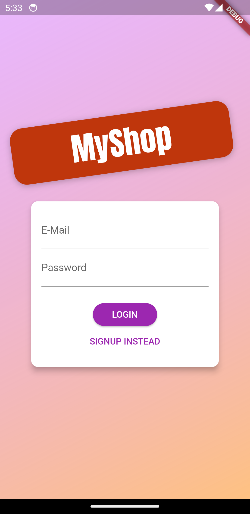
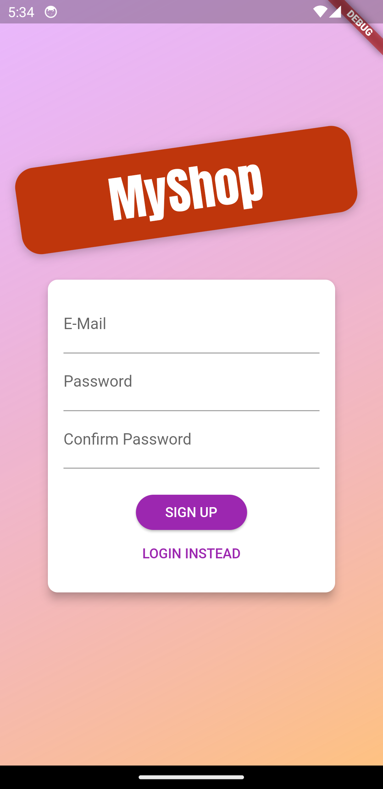
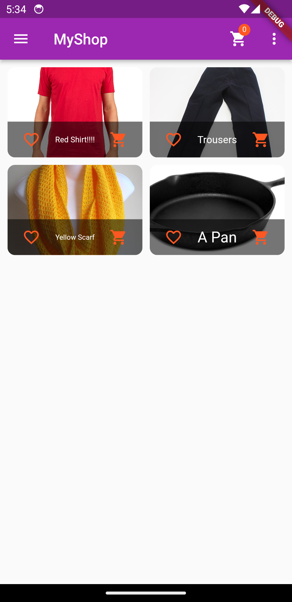
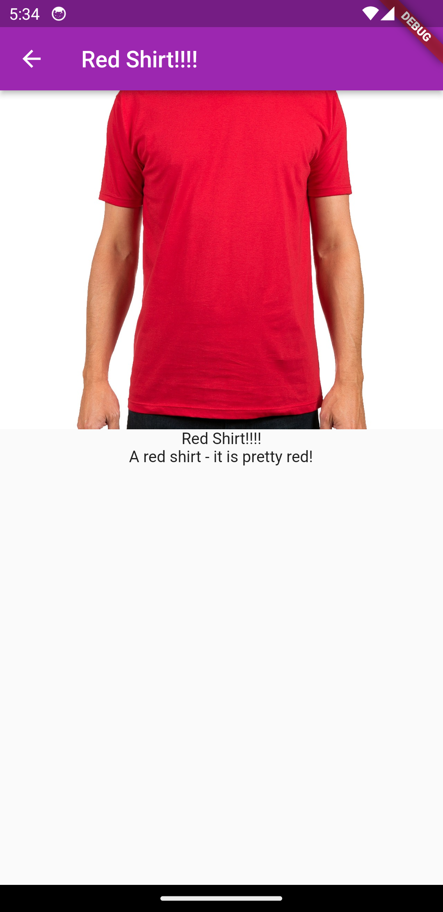
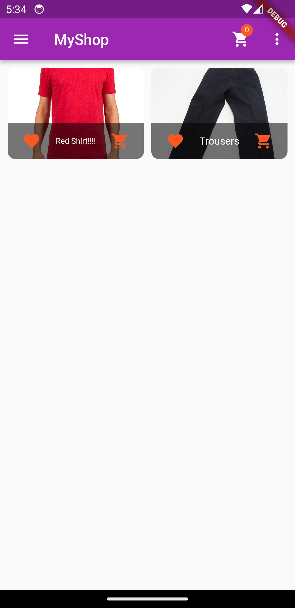
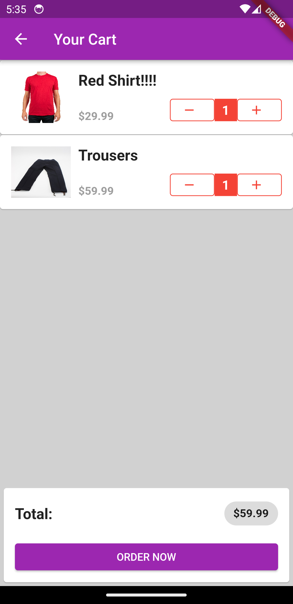
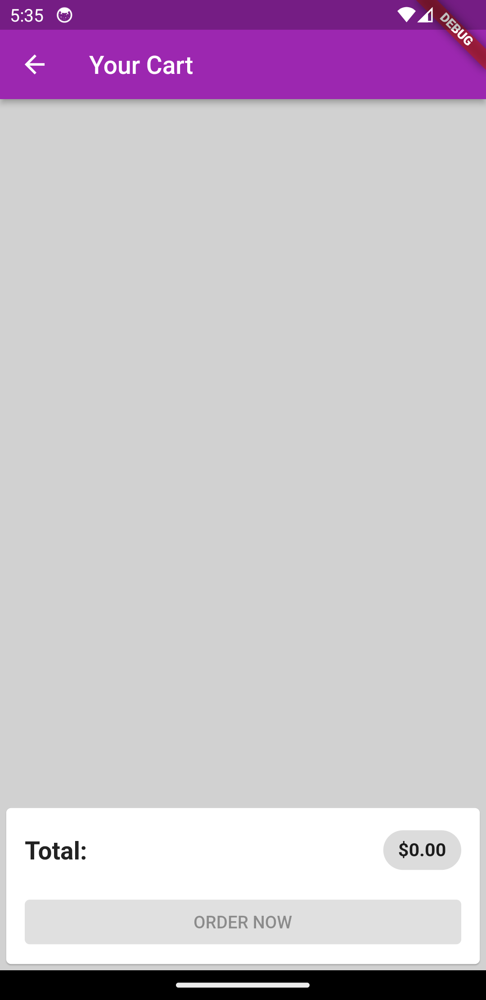
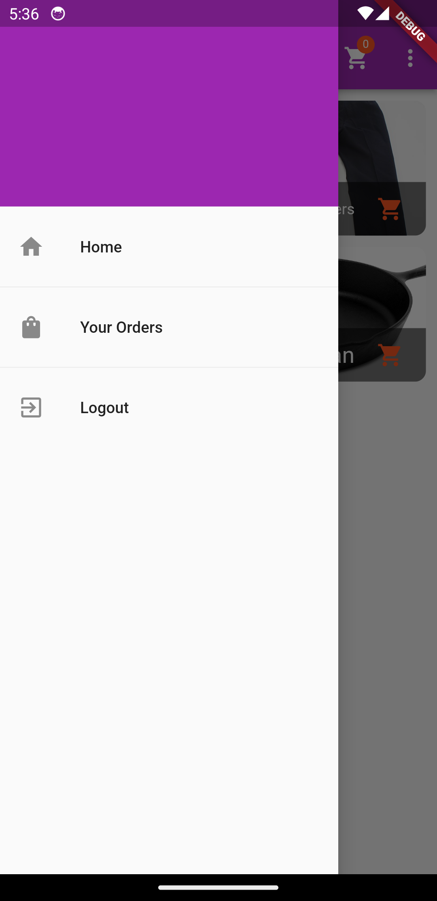
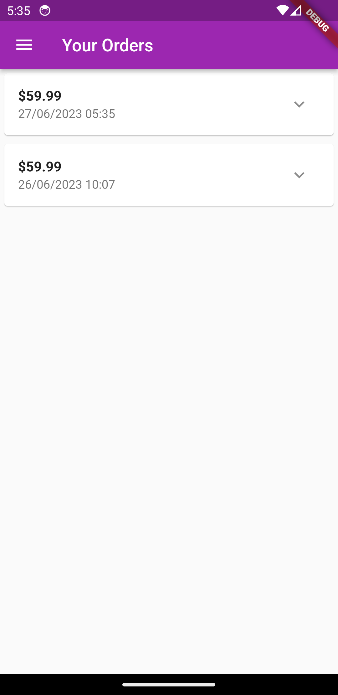
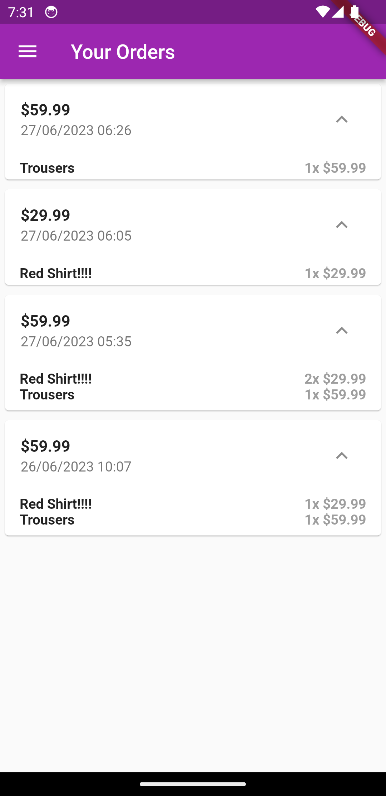

# Project Title

Basic Shop App made with Flutter 

The Basic Shop App is a Flutter application designed to provide a seamless shopping experience for users. It leverages the Firebase API for authentication and uses the Firebase real-time database as its database solution. The app also employs the Provider package for state management, ensuring efficient and scalable management of the application state.

The app consists of three main pages, each catering to different functionalities:

1. Product Overview Page:
The first page of the app is the product overview page. It showcases all the available products in a visually appealing manner. Each product is displayed within a container, featuring an image, a favorite button for users to mark products as favorites, a title, and an "Add to Cart" button. The page also includes an app bar with a side drawer located at the leftmost corner. On the app bar, there is a popup menu button that provides options to filter and display all products or only the user's favorites. Adjacent to the popup menu button, there is a cart button displaying a badge indicating the number of items in the cart. Clicking on the cart button allows users to navigate to the cart page. The side drawer contains three buttons: "Home" for returning to the main product overview page, "Your Orders" to view previous orders, and "Log Out" to sign out from the app.

2. Cart Page:
The second page is the cart page, where users can review and manage the items they have added to their cart. Each cart item is presented with a product image, title, price, and quantity. Users can increase or decrease the quantity of items using dedicated buttons. At the bottom of the page, there is a container displaying the total price of the items in the cart. Additionally, an "Order Now" button is present, allowing users to proceed with their purchase. This button is disabled when the cart is empty, preventing users from placing an order without selecting any products.

3. Your Orders Page:
The third page is the "Your Orders" page, which offers users a comprehensive view of their previous orders. Each order is enclosed within a container, displaying the total price and the date and time when the order was placed. At the right-most corner of each order container, there is a down arrow or expand button. Clicking on this button reveals a detailed breakdown of the order, including the titles, prices, and quantities of the products associated with that particular order. This expandable view provides users with a convenient way to review their past purchases.

Overall, the Basic Shop App offers users a user-friendly interface with seamless navigation between the main product overview page, the cart page, and your orders page. The integration of Firebase API and Firebase real-time database ensures secure user authentication and reliable data storage, while the implementation of basic animations enhances the overall user experience. The use of Provider for state management allows for efficient and scalable management of the application state, ensuring smooth performance even with a growing number of users and products.

<a href="./shop_app_v1.apk"></img></a>

# 📸 Screenshots
The screenshots below are taken on an Android emulator.

| 1 | 2|
|------|-------|
|||

| 3 | 4|
|------|-------|
|||

| 5 | 6|
|------|-------|
|||

| 7 | 8|
|------|-------|
|||

| 9 | 10|
|------|-------|
|||
